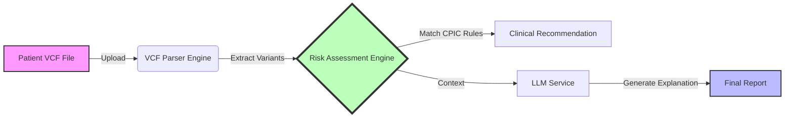

# GenRx — Pharmacogenomic Support System


<div align="center">

[](https://opensource.org/licenses/MIT)
[](https://fastapi.tiangolo.com)
[](https://react.dev)
[](https://deepmind.google/technologies/gemini/)


**"Your DNA is unique. Your medication should be too."**

[View Demo](#) • [Report Bug](https://github.com/yourusername/GenRx/issues) • [Request Feature](https://github.com/yourusername/GenRx/issues)

</div>

---

## � The Problem
Adverse Drug Reactions (ADRs) are the **4th leading cause of death** in hospitalized patients.
-   Standard dosing is "one size fits all," but patients metabolize drugs differently based on their genetics.
-   Clinical Pharmacogenomic (PGx) reports are often dense, jargon-heavy PDF files that patients cannot understand.
-   Doctors lack real-time, point-of-care tools to map genetic variants to dosing guidelines.

## 💡 The Solution: GenRx
**GenRx** is an AI-powered precision medicine platform that democratizes pharmacogenomics.
1.  **Ingests raw genetic data** (VCF files) from consumer tests (23andMe, Ancestry) or clinical sequencing.
2.  **Instantly maps genotypes** to **CPIC Level A** clinical guidelines.
3.  **Generates plain-English explanations** using advanced LLMs (Gemini 1.5), explaining *why* a drug is risky and *what* to do about it.
4.  **Provides a Chat Interface** for patients to ask follow-up questions about their own genome.

---

## ⚙️ How It Works



### 1. The VCF Neural Parser (`vcf_parser.py`)
-   Parses VCF v4.2 files with support for **GRCh37/38** coordinates.
-   Detects variants via **rsID lookup** OR **Chromosomal Position**.
-   Calculates **Diplotypes** (e.g., `*1/*4`) and **Phenotypes** (e.g., *Poor Metabolizer*) by summing allele functional status.

### 2. The Risk Engine (`risk_engine.py`)
Strict implementation of **CPIC (Clinical Pharmacogenetics Implementation Consortium)** guidelines for high-risk drug-gene pairs:

| Drug Class | Target Drug | Primary Gene | Phenotypes Analyzed |
| :--- | :--- | :--- | :--- |
| **Pain** | Codeine, Tramadol | `CYP2D6` | PM, IM, NM, URM |
| **Cardio** | Clopidogrel (Plavix) | `CYP2C19` | PM, IM, NM, URM |
| **Cardio** | Warfarin | `CYP2C9` | PM, IM, NM |
| **Statin** | Simvastatin | `SLCO1B1` | PM, IM, NM |
| **Immunosup.** | Azathioprine | `TPMT` | PM, IM, NM |
| **Oncology** | Fluorouracil (5-FU) | `DPYD` | PM, IM, NM |

### 3. The Clinical Intelligence Layer (`llm_service.py`)
-   **Primary Brain**: Google Gemini 1.5 Flash (via API).
-   **Fallback Brain**: Groq (Llama 3 70B) for high-speed redundancy.
-   **Safety Net**: Hard-coded rule-based templates if offline.
-   Generates: *Mechanism of Action*, *Risk Rationale*, and *Patient-Friendly Summary*.

---

## � Screenshots

| Upload & Analyze | Interactive Risk Report |
|:---:|:---:|
|  |  |
| *Drag-and-drop simple interface* | *Clear Red/Yellow/Green risk indicators* |

| AI Genome Chat | PDF Export |
|:---:|:---:|
|  |  |
| *Ask questions about your DNA* | *Clinical-grade reports for doctors* |

---

## 🛠️ Technology Stack

### Frontend (The Face)
-    **React 19**: Latest features including Actions and Optimistic UI.
-    **Vite**: Sub-millisecond HMR.
-    **Tailwind CSS v4**: Zero-runtime styling.
-    **Lucide React**: Beautiful, consistent iconography.

### Backend (The Brain)
-    **Python 3.10+**: Type-safe logic.
-    **FastAPI**: Async, high-concurrency API server.
-    **Pydantic**: Data validation for complex genomic structures.

---

## 🚀 Installation & Setup

### Prerequisites
-   Python 3.10+
-   Node.js 18+

### 1. Clone & Configure
```bash
git clone https://github.com/yourusername/GenRx.git
cd GenRx
```

### 2. Backend (FastAPI)
```bash
cd backend
python -m venv venv
# Activate: source venv/bin/activate (Mac) or venv\Scripts\activate (Win)
pip install -r requirements.txt

# Create .env file
echo "GEMINI_API_KEY=your_key_here" > .env
echo "GROQ_API_KEY=your_key_here" >> .env

uvicorn main:app --reload
```
*Server running at `http://localhost:8000`*

### 3. Frontend (React)
```bash
cd frontend
npm install
npm run dev
```
*App running at `http://localhost:5173`*

---

## � Future Roadmap
-   [ ] **HL7/FHIR Integration**: Direct messy EGR compatibility.
-   [ ] **Whole Genome Support**: Expand beyond the core 6 genes.
-   [ ] **Doctor Portal**: Multi-patient dashboard for clinicians.
-   [ ] **Mobile App**: React Native port for patients on the go.

## 🤝 Contributing
GenRx is open-source! We welcome PRs for new drug-gene pairs.
1.  Fork the repo.
2.  Create your feature branch (`git checkout -b feature/AmazingFeature`).
3.  Commit your changes.
4.  Open a Pull Request.

## � License
Determined by hackathon rules (MIT License).

---

<p align="center">
  Built with ❤️ for <strong>Precision Medicine Hackathon 2026</strong>
</p>
